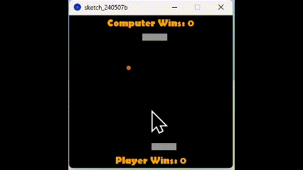

# Pong Game

A simple Pong game built using Processing. This game features a player, computer, and a ball. The goal is to win by scoring three points before the computer does.

## Features

- Player vs. Computer gameplay.
- Score tracking with a display for player and computer wins.
- Game over messages when either the player or the computer wins.
- Simple and intuitive controls.

## Live Demo


## Installation

1. **Clone the Repository:**

   ```sh
   git clone https://github.com/xliu1213/processing-game.git

2. **Navigate to the Project Directory.**

3. **Make sure Processing is installed.**

4. **Open the sketch_240507b.pde file.**

5. **To run the game, click the play button in the Processing IDE. The game window will open, displaying the initial game screen.**
